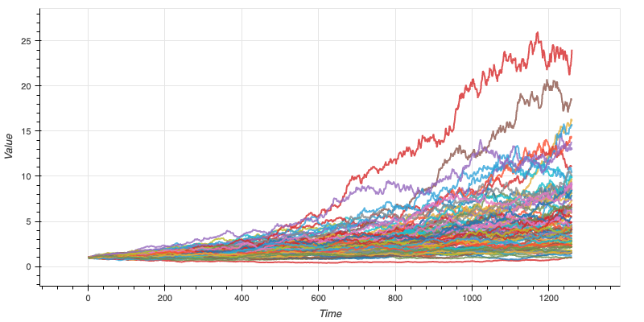
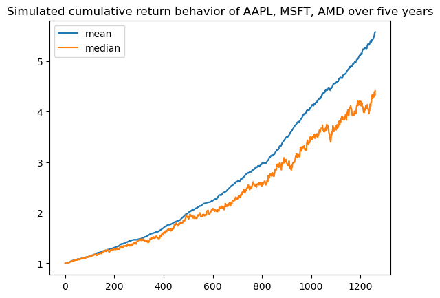
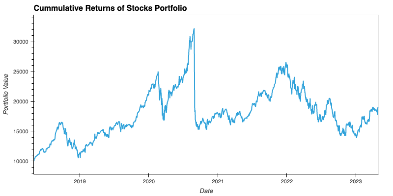

# Results Analysis

In every portfolio which consists of three , we analyze data of a 5 year span from 5/1/2018 to 5/1/2023, Monte Carlo Forecasting Tool is used to calculate cummulative returns with equally weighted, analyzed results are demonstrated as:
    - Line plot
    - Probability distribution and confidence intervals
    - Interactive plot
    - Mean/median of simulated cummulative returns
In addition, using the lower and upper 95% confidence intervals, we calculate the range of possible outcomes of the initial investment, which $10,000 is used as an example in this project.
We also calculate what each portfolio would have returned today if the investment was made 5 years ago and the cummulative returns of $10,000 throughout 5 years is demontrated as a line plot.

# Stocks (AAPL, MSFT, AMD)

## Line llot

## Probability distribution and confidence intervals

## Interactive plot

## Mean/median of simulated cummulative returns

## Cummulative return of $10,000 investment

