# Results Analysis

In every portfolio which consists of three tickers, we analyze data of a 5 year span from 5/1/2018 to 5/1/2023, Monte Carlo Forecasting Tool is used to calculate cummulative returns with equally weighted, analyzed results are demonstrated as:
- Line plot 
- Probability distribution and confidence intervals
- Interactive plot
- Mean/median of simulated cummulative returns

In addition, using the lower and upper 95% confidence intervals, we calculate the range of possible outcomes of the initial investment, which 10,000 is used as an example in this project.

We also calculate what each portfolio would have returned today if the investment was made 5 years ago and the cumulative returns of 10,000 throughout 5 years is demonstrated as a line plot.

# Stocks (AAPL, MSFT, AMD)

## Line plot
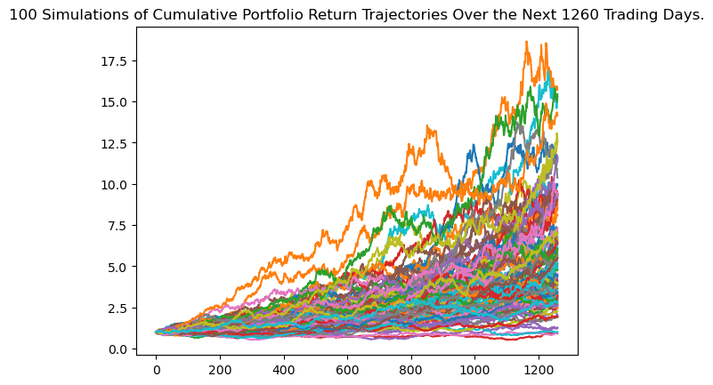

## Probability distribution and confidence intervals
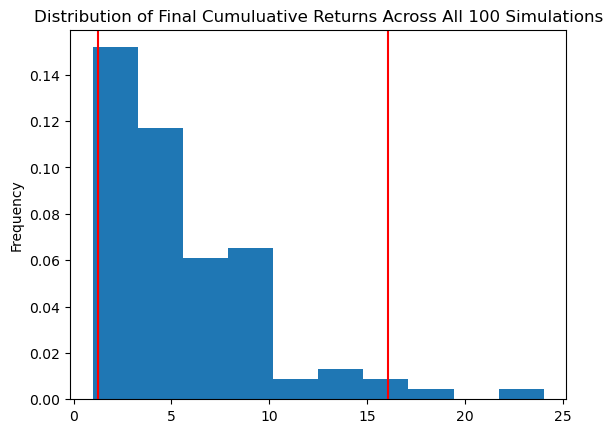

## Interactive plot
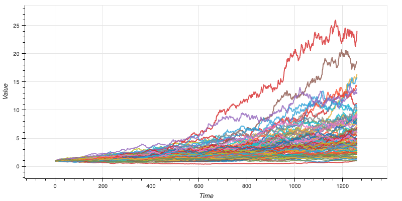

## Mean/median of simulated cummulative returns
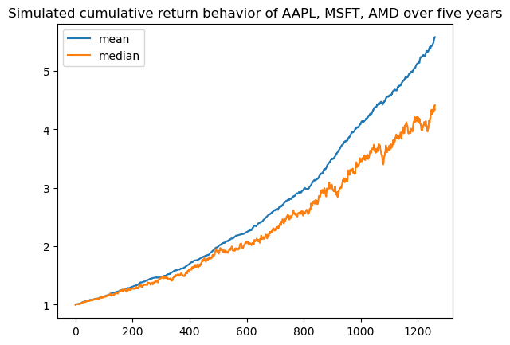

## Cummulative return of $10,000 investment
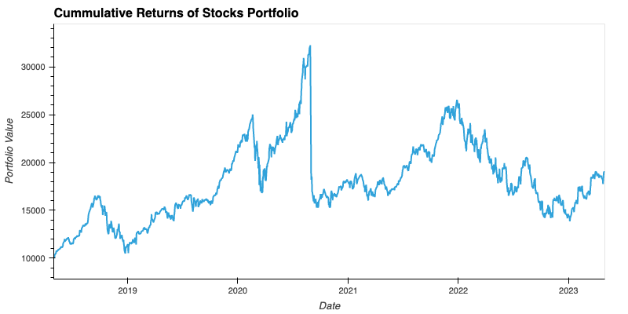

There is a 95% chance that an initial investment of 10000 in the portfolio over the next year will end within in the range of 16219.38 and 177708.94.
If you had invested 10,000 evenly into this portfolio on May 1st, 2018 it would be worth 19010.22048104522 today.

# Forex (EUR, JPY, GBP)

## Line plot
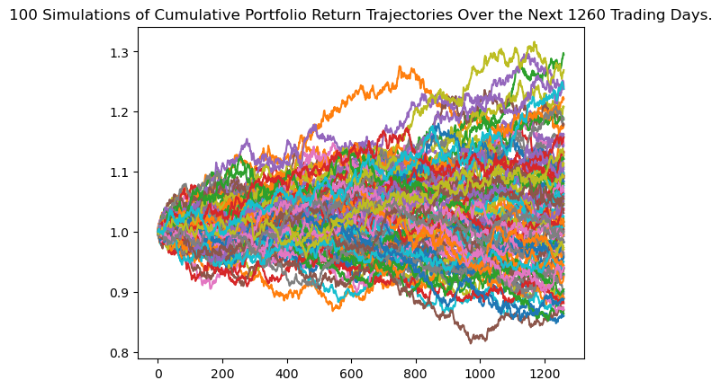

## Interactive plot
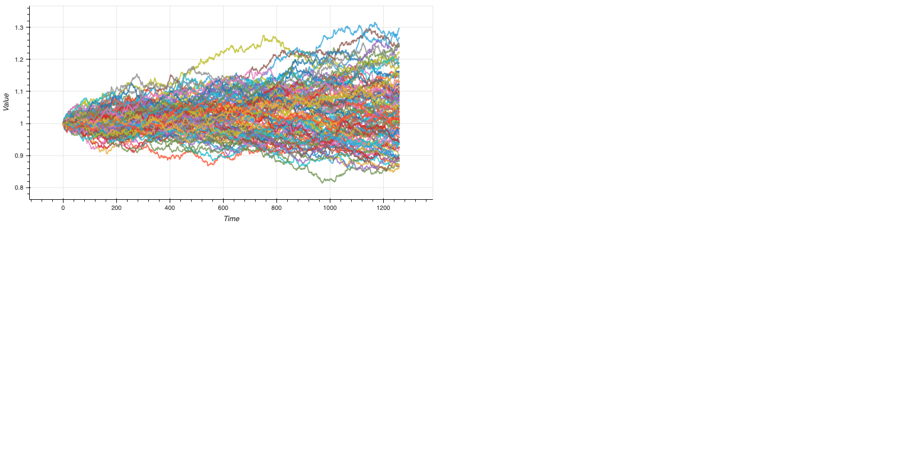

## Mean/median of simulated cummulative returns
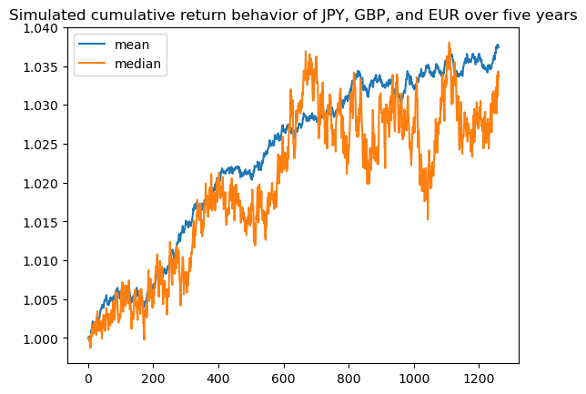

## Cummulative return of $10,000 investment
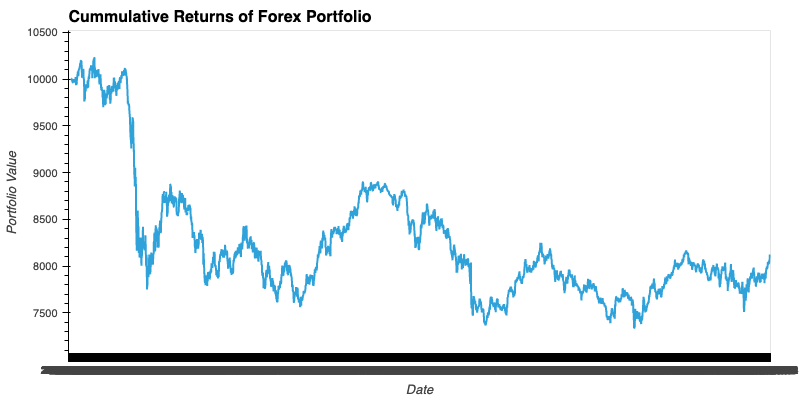

There is a 95% chance that an initial investment of 10000 in the portfolio over the next year will end within in the range of 8702.49 and 12399.65.
If you had invested 10,000 evenly into this portfolio on May 1st, 2018 it would be worth 8351.607159342295 today.

# Crypto (BTC, ETH, DOGE)

## Line plot
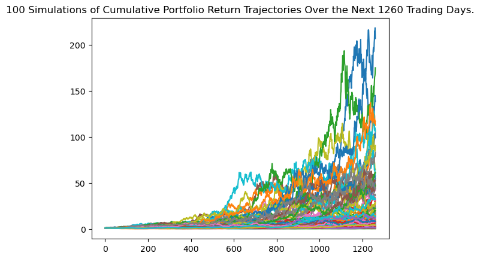

## Interactive plot
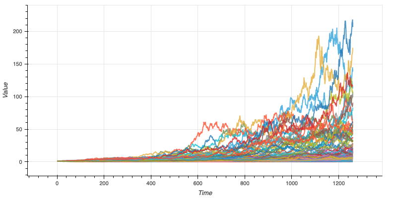

## Mean/median of simulated cummulative returns
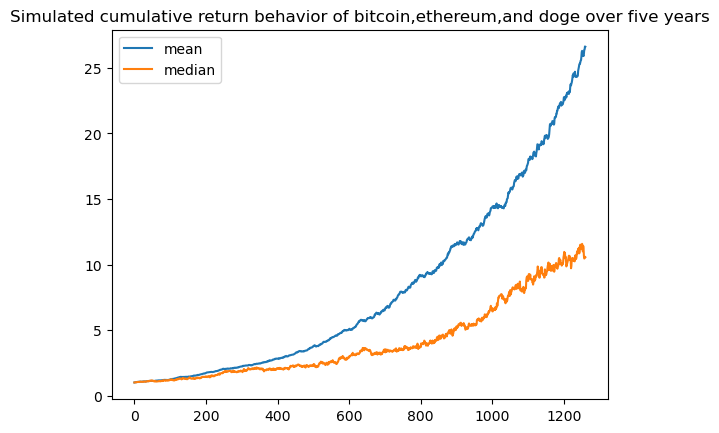

## Cummulative return of $10,000 investment
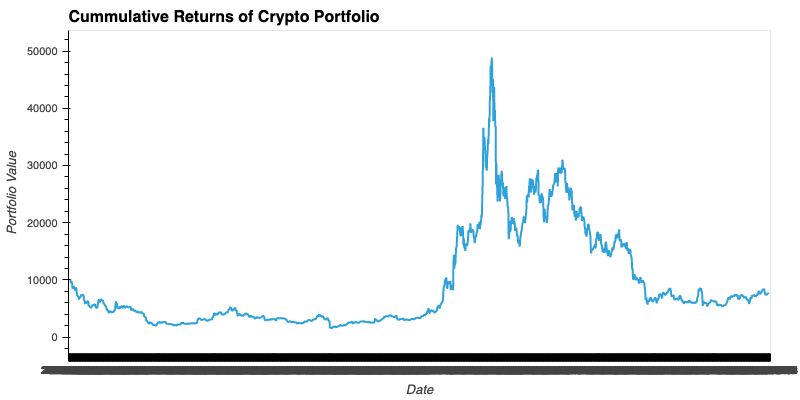

There is a 95% chance that an initial investment of 10000 in the portfolio over the next year will end within in the range of 5385.9 and 1280704.89. 
If you had invested 10,000 evenly into this portfolio on May 1st, 2018 it would be worth 25258.341119739092 today.

# Commodities (gold, silver, copper)

## Line plot
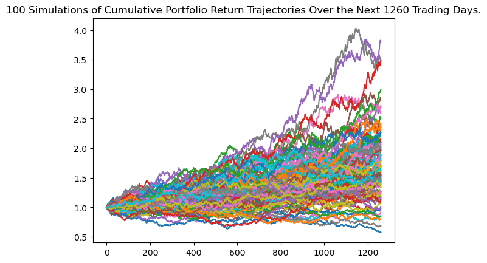

## Interactive plot
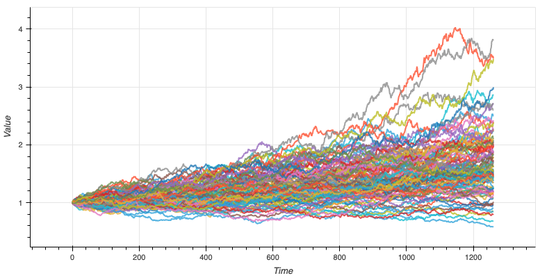

## Mean/median of simulated cummulative returns
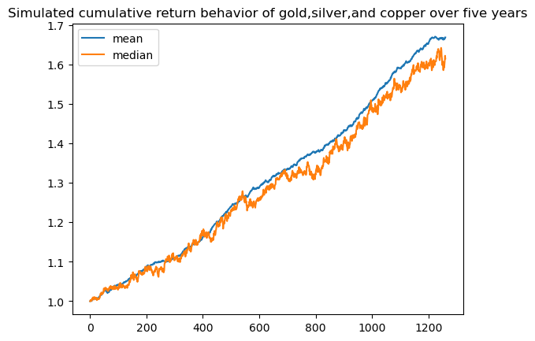

## Cummulative return of $10,000 investment
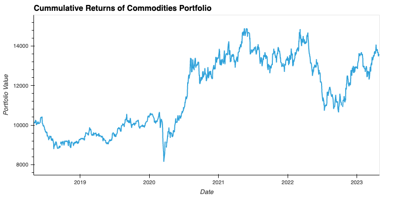

There is a 95% chance that an initial investment of 10000 in the portfolio over the next year will end within in the range of 8239.92 and 32518.06.
If you had invested 10,000 evenly into this portfolio on May 1st, 2018 it would be worth 13582.53040604009 today.